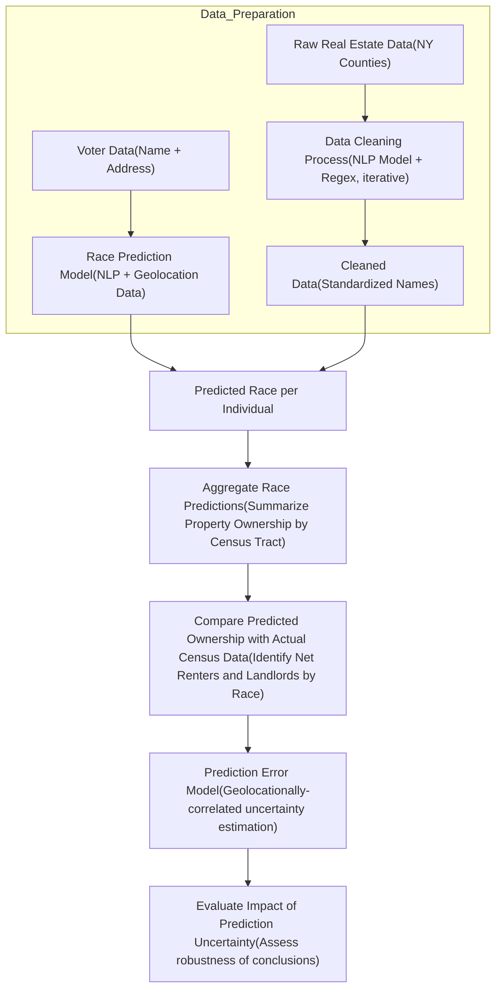

```mermaid
graph TD

subgraph Data_Preparation
  A["Voter Data(Name + Address)"] --> D["Race Prediction Model(NLP + Geolocation Data)"]
  B["Raw Real Estate Data(NY Counties)"] --> C["Data Cleaning Process(NLP Model + Regex, iterative)"]
  C --> E["Cleaned Data(Standardized Names)"]
end

D --> F["Predicted Race per Individual"]
E --> F

F --> G["Aggregate Race Predictions(Summarize Property Ownership by Census Tract)"]
G --> H["Compare Predicted Ownership with Actual Census Data(Identify Net Renters and Landlords by Race)"]
H --> I["Prediction Error Model(Geolocationally-correlated uncertainty estimation)"]
I --> J["Evaluate Impact of Prediction Uncertainty(Assess robustness of conclusions)"]
```
