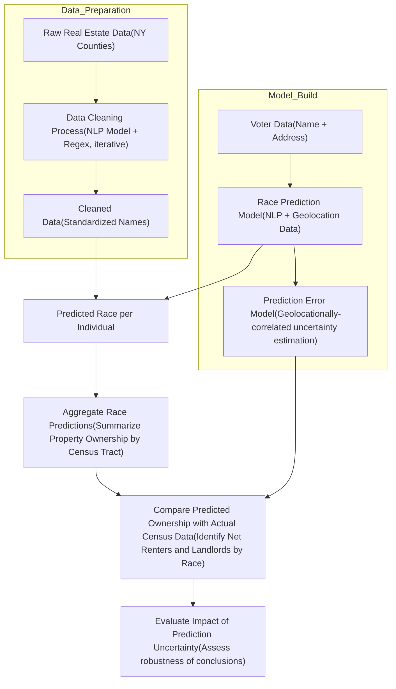

```mermaid
graph TD


subgraph Model_Build
  A["Voter Data(Name + Address)"] --> B["Race Prediction Model(NLP + Geolocation Data)"]-->C["Prediction Error Model(Geolocationally-correlated uncertainty estimation)"]

end
subgraph Data_Preparation
  D["Raw Real Estate Data(NY Counties)"] --> E["Data Cleaning Process(NLP Model + Regex, iterative)"]
  E --> F["Cleaned Data(Standardized Names)"]
end

F --> G["Predicted Race per Individual"]
B --> G

G --> H["Aggregate Race Predictions(Summarize Property Ownership by Census Tract)"]
H --> I["Compare Predicted Ownership with Actual Census Data(Identify Net Renters and Landlords by Race)"]
C--> I
I --> J["Evaluate Impact of Prediction Uncertainty(Assess robustness of conclusions)"]
```
